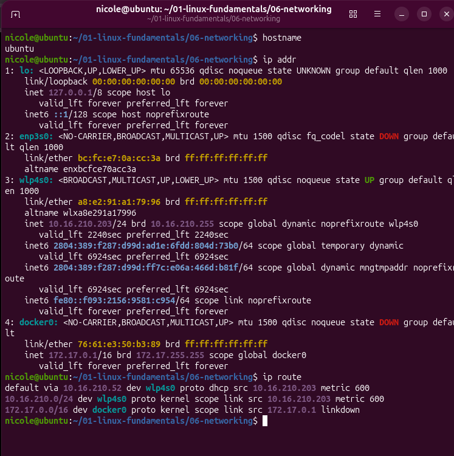

# 🌐 06 - Networking

## 🎯 Objetivo

Compreender os fundamentos de redes no Linux, identificando interfaces de rede, endereços IP, gateway e rotas utilizadas pelo sistema.

## 🧪 Exercício 01 - Identificação da rede

### 💻 Comandos utilizados

```bash
hostname
ip addr
ip route
🔎 Resultados encontrados
🖥️ Hostname:

ubuntu
```

📡 Interface de rede utilizada:
```
wlp4s0
A interface wlp4s0 corresponde à conexão Wi-Fi e está ativa.
```

🌍 Endereço IPv4:
```
10.16.210.203/24
```

🚪 Gateway padrão:
```
10.16.210.52
```
🏠 Rede local:
```
10.16.210.0/24
```
🔌 Outras interfaces identificadas
Durante a análise também foram encontradas:

🔄``` lo``` — interface de loopback, utilizada para comunicação interna da própria máquina.
🔌 ```enp3s0``` — interface Ethernet, atualmente sem conexão.
🐳 ```docker0``` — interface de rede virtual criada pelo Docker.
A interface ```docker0``` possui o endereço:
```172.17.0.1/16```

📚 O que aprendi
Neste exercício, pratiquei a identificação das principais informações de rede de um sistema Linux.
Aprendi a utilizar os comandos ```hostname```, ```ip addr``` e ```ip route``` para identificar:

o nome do computador;
as interfaces de rede disponíveis;
o endereço IP da máquina;
a rede local;
o gateway padrão;
as rotas utilizadas pelo sistema.
Também pude observar a diferença entre uma interface física de rede, a interface de loopback e uma interface virtual criada pelo Docker.

### 📸 Evidência

**Screenshot:** `screenshots/exercicio-01-identificacao-da-rede.png`


