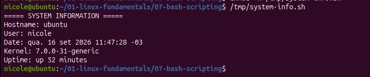

# 🐚 07 - Bash Scripting

## 🎯 Objetivo

Praticar a criação e execução de scripts Bash no Linux, utilizando comandos do sistema para coletar e exibir informações da máquina.

## 🧪 Exercício 01 - Primeiro script Bash

### 💻 Script utilizado

Foi criado um script Bash para exibir informações básicas do sistema:

```bash
#!/bin/bash

echo "===== SYSTEM INFORMATION ====="

echo "Hostname: $(hostname)"
echo "User: $(whoami)"
echo "Date: $(date)"
echo "Kernel: $(uname -r)"
echo "Uptime: $(uptime -p)"
```

###🔧 Permissão de execução

Para permitir a execução do script, foi utilizado:
```
chmod +x /tmp/system-info.sh
```

### ▶️ Execução

O script foi executado com:
```
/tmp/system-info.sh
```

### 📋 Resultado

O script apresentou informações como:

🖥️ Hostname da máquina

👤 Usuário atual

📅 Data e horário

🐧 Versão do kernel

⏱️ Tempo de atividade do sistema

### 📚 O que aprendi

Neste exercício, pratiquei os fundamentos básicos de criação e execução de scripts Bash.

Aprendi a:
criar um script utilizando Bash;

utilizar ```#!/bin/bash``` para definir o interpretador;

utilizar ```echo``` para exibir informações;

executar comandos dentro de ```$(...)```;

conceder permissão de execução com ```chmod +x```;

executar um script pelo terminal.


Também entendi como o Bash pode automatizar tarefas utilizando comandos que já fazem parte do sistema Linux.

### 📸 Evidência

**Screenshot:** `screenshots/exercicio-01-primeiro-script-bash.png`



