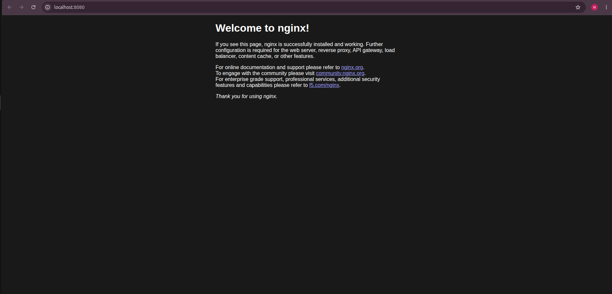
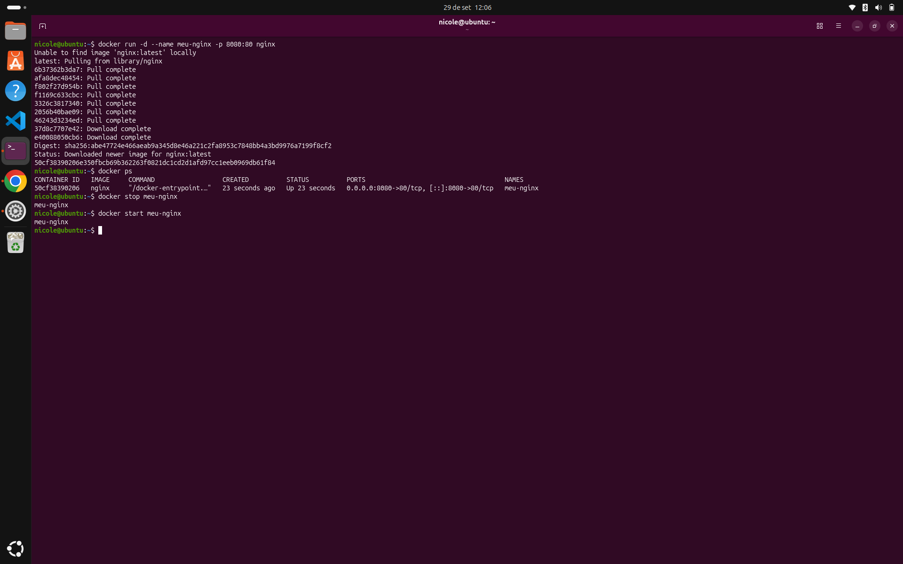

# 08 - Docker Fundamentals

## Objetivo

Praticar os fundamentos do Docker no Ubuntu Linux, desde a instalação até a execução e o gerenciamento de um servidor web em container.

Este laboratório faz parte dos meus estudos práticos em Linux, infraestrutura e DevOps.

## Ambiente utilizado

* Ubuntu 26.04 LTS
* Arquitetura: amd64
* Docker Engine
* Docker Hub
* Nginx

## 1. Instalação e validação do Docker

Após instalar o Docker Engine, validei o funcionamento com:

```bash
docker run hello-world
```

O resultado confirmou a comunicação com o Docker daemon, o download da imagem e a execução do primeiro container.

## 2. Execução do Nginx

Utilizei a imagem oficial do Nginx disponível no Docker Hub:

```bash
docker run -d --name meu-nginx -p 8080:80 nginx
```

### Parâmetros utilizados

| Parâmetro          | Descrição                                                 |
| ------------------ | --------------------------------------------------------- |
| `-d`               | Executa o container em segundo plano.                     |
| `--name meu-nginx` | Define o nome do container.                               |
| `-p 8080:80`       | Mapeia a porta 8080 do host para a porta 80 do container. |
| `nginx`            | Imagem utilizada para executar o servidor web.            |

Após iniciar o container, acessei o servidor pelo navegador:

http://localhost:8080

A página padrão do Nginx foi exibida com sucesso.

## 3. Gerenciamento do container

Para listar os containers em execução:

```bash
docker ps
```

Para parar o container:

```bash
docker stop meu-nginx
```

Para iniciar novamente:

```bash
docker start meu-nginx
```

## 4. Resultados e aprendizados

* Instalação e validação do Docker Engine.
* Download e execução de imagens do Docker Hub.
* Criação e gerenciamento de containers.
* Mapeamento de portas entre o host e o container.
* Execução local de um servidor web Nginx.

Este laboratório permitiu conectar os conceitos de Linux, redes e containers, colocando em prática comandos fundamentais para ambientes de infraestrutura e DevOps.

## 5. Evidências

### Nginx funcionando no navegador



### Comandos Docker no terminal



---

**Status:** Laboratório concluído.

**Próximos estudos:** Dockerfile, volumes, redes Docker e Docker Compose.
